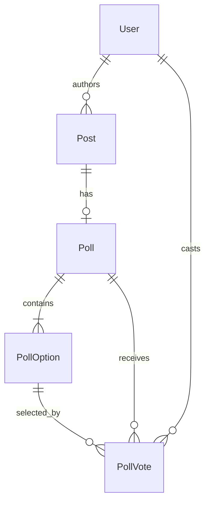

# 投票貼文資料庫設計

## ER 關係



一則 `Post` 最多對應一個 `Poll`（一對零或一）。投票選項與投票紀錄分表儲存，避免在 `Post` 主表重複欄位。

## 資料表

### `poll`

| 欄位 | 型別 | 約束 | 說明 |
|------|------|------|------|
| `id` | INTEGER | PRIMARY KEY | 投票主鍵 |
| `post_id` | INTEGER | NOT NULL, UNIQUE, FK → `post.id` | 所屬貼文 |
| `created_at` | DATETIME (TZ) | NOT NULL | 建立時間 |

**索引**：`post_id`（UNIQUE 同時具查詢用途）

### `poll_option`

| 欄位 | 型別 | 約束 | 說明 |
|------|------|------|------|
| `id` | INTEGER | PRIMARY KEY | 選項主鍵 |
| `poll_id` | INTEGER | NOT NULL, FK → `poll.id` | 所屬投票 |
| `label` | VARCHAR(200) | NOT NULL | 選項文字 |
| `position` | SMALLINT | NOT NULL, 1–4 | 顯示順序 |

**唯一約束**：`(poll_id, position)` — 同一投票內順序不重複  
**檢查約束**：`position >= 1 AND position <= 4`

### `poll_vote`

| 欄位 | 型別 | 約束 | 說明 |
|------|------|------|------|
| `id` | INTEGER | PRIMARY KEY | 投票紀錄主鍵 |
| `poll_id` | INTEGER | NOT NULL, FK → `poll.id` | 所屬投票 |
| `option_id` | INTEGER | NOT NULL, FK → `poll_option.id` | 所選選項 |
| `user_id` | INTEGER | NOT NULL, FK → `user.id` | 投票者 |
| `created_at` | DATETIME (TZ) | NOT NULL | 投票時間 |

**唯一約束**：`(poll_id, user_id)` — 每位使用者對同一則投票貼文只能投一次（不可改投）

## 與既有 `post` 的關係

- 投票貼文仍為一般 `Post` 列，透過 `poll.post_id` 關聯。
- `Post.body` 可作為投票問題；若未填寫，建立時以佔位文字滿足既有 `ck_post_has_content` 約束。
- 轉發（`repost_of_id`）時，UI 以 `display_post` 顯示原始貼文的 `poll` 與選項。

## 查詢與效能

- Feed 載入時以 `joinedload(Post.poll).joinedload(Poll.options)` 避免 N+1。
- 票數以 `GROUP BY option_id` 批次彙總至 `poll_stats` helper，供模板顯示百分比。

## 初始化

本專案以 SQLAlchemy `db.create_all()` 建表。新增模型後請執行：

```bash
task init-db
```

若使用 Supabase 既有資料庫，請執行 `task setup-supabase` 或於 SQL Editor 手動建立上述三表。
